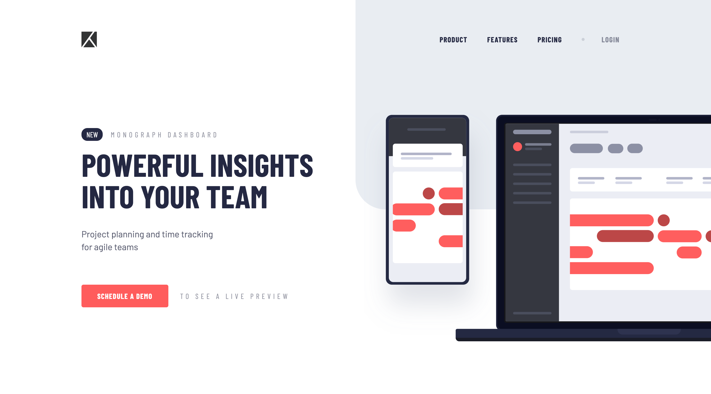

# Project tracking intro

This is a solution to the [project tracking intro component challenge on Frontend Mentor](https://www.frontendmentor.io/challenges/project-tracking-intro-component-5d289097500fcb331a67d80e). Frontend Mentor challenges help you improve your coding skills by building realistic projects.

- [The challenge](#the-challenge)
- [Screenshot](#screenshot)
- [Links](#links)
- [Built with](#built-with)
- [Author](#author)

### The challenge

Users should be able to:

- View the optimal layout for the site depending on their device's screen size
- See hover states for all interactive elements on the page
- Create the background shape using code

## Screenshot

## Links

- [Solution URL](https://github.com/annaindistress/frontend-mentor-project-tracking-intro)
- [Live Site URL](https://annaindistress.github.io/frontend-mentor-project-tracking-intro/)

## Built with

- Semantic HTML5 markup
- CSS custom properties
- Flexbox
- PostCSS
- Mobile-first workflow
- Vanilla JavaScript
- Vite
- Tailwind CSS

## Author

- Frontend Mentor - [@annaindistress](https://www.frontendmentor.io/profile/annaindistress)
- Twitter - [@annaindistress](https://www.twitter.com/annaindistress)
